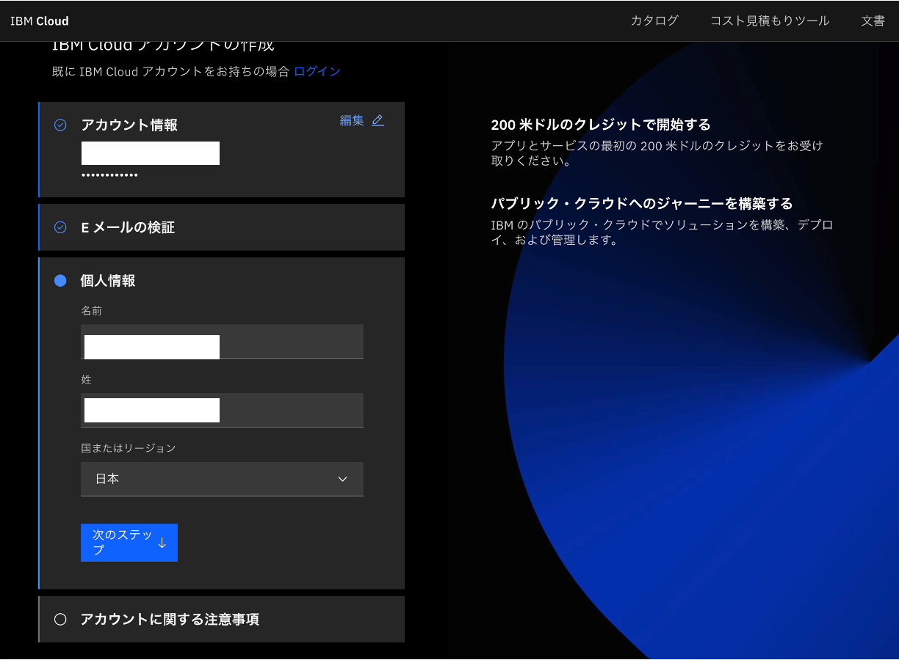

# how-to-create-ibmid
IBMidとIBM Cloudアカウントの作成方法をご説明します

## 注意事項
* 無料のLiteプランのみを利用する場合でも､クレジットカード情報の登録が必要です｡
* フリーメールアドレスを登録した場合､アカウント作成ができない場合があります｡その場合は会社のメールアドレスをご使用ください｡
* 以下の手順は2023年7月12日時点の情報です｡手順や画面レイアウトはIBM Cloudの今後のアップデートにより変更になる可能性があります｡
 
 
# IBMidの作成
1. 以下のURLにアクセスします  
https://cloud.ibm.com/login

1. 「アカウントの作成」をクリックします｡

1. アカウントの作成画面でEメール､パスワードを設定し､「次のステップ」をクリックします｡

1. 登録したメールアドレスに検証コードが送信されます｡

1. ブラウザで､メール内の7桁の検証コードを「検証コード」に入力し､「次のステップ」をクリックします｡

1. 「名前」､「姓」､「国またはリージョン」を入力し､「次のステップ」をクリックします｡

1. マーケティングメールの受信希望(任意)､契約条件への同意にチェックし､「続行」をクリックします｡

1. 「アカウントのプライバシー通知を確認する」ページの内容を確認します｡「同意」にチェックし､「続行」をクリックします｡

1. IBMidが作成されました｡

# IBM Cloud初回ログイン
1. 「IBM Cloudにログイン」の画面で入力されたメールアドレスを確認し､「続行」をクリックします｡

1. IBMidの作成時に設定したパスワードを入力し､「ログイン」をクリックします｡

1. 登録したメールアドレスに検証コードが送信されます｡

1. ブラウザで､メール内の6桁の検証コードを「検証コード」に入力し､「確認」をクリックします｡

# IBM Cloudアカウント作成
1. 「本人確認」画面で「会社名」を選択し「次のステップ」をクリックします｡(個人でご利用の場合は「個人」を選択してください｡その場合､次のステップの会社情報の入力はスキップされます｡)

1.「会社名」､「国またはリージョン」を入力し､「次のステップ」をクリックします｡

1. クレジットカードの請求先である氏名､住所､電話番号の情報を入力します｡「次のステップ」をクリックします｡

1. クレジットカード情報を入力します｡「次のステップ」をクリックします｡

1. 「アカウントの作成」をクリックします｡

1. IBM Cloudにログインできました｡以上でアカウント作成手順は終了です｡
